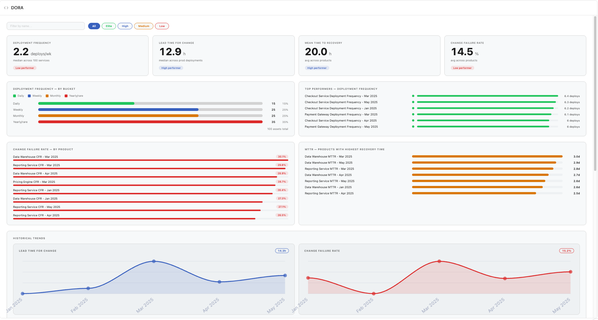

# DORA Dashboard

A DORA metrics dashboard widget for [Port](https://app.port.io) dashboards. Displays the four DORA metrics — Deployment Frequency, Lead Time for Change, Change Failure Rate, and Mean Time to Recovery — with trend cards and historical data from catalog entities.

## Preview image



## Features

- Four DORA metric cards with current values and trend indicators
- Historical trend visualization per metric
- Configurable blueprint and property key mapping for each metric
- Respects dashboard page filters
- Light/dark theme support via Port SDK

## Prerequisites

### Blueprints & properties

The widget reads from four blueprints — one per DORA metric. These blueprints must exist in your Port catalog and contain entity records representing measurement periods.

| Blueprint param | Purpose | Key properties needed |
|-----------------|---------|----------------------|
| `dfBlueprint` | Deployment Frequency | deploy count, bucket rating, period |
| `ltBlueprint` | Lead Time for Change | lead time hours, period |
| `cfrBlueprint` | Change Failure Rate | failure rate %, period |
| `mttrBlueprint` | Mean Time to Recovery | recovery hours, period |

Default property keys follow Port's standard DORA integration schema. Override them with the `*Prop` parameters if your blueprints use different property names.

### Integrations

Port's [DORA Metrics](https://docs.getport.io/guides/all/create-and-track-dora-metrics) Ocean integration or a custom ingestion pipeline must be populating the four blueprints with metric entities before the widget will show data.

## Widget parameters

| Key | Type | Required | Default | Description |
|-----|------|----------|---------|-------------|
| `dfBlueprint` | blueprint | yes | — | Deployment Frequency blueprint |
| `ltBlueprint` | blueprint | yes | — | Lead Time for Change blueprint |
| `cfrBlueprint` | blueprint | yes | — | Change Failure Rate blueprint |
| `mttrBlueprint` | blueprint | yes | — | Mean Time to Recovery blueprint |
| `dfCountProp` | string | no | `numberOfDeploys` | Property holding deploy count |
| `dfBucketProp` | string | no | `deploymentFrequencyBucket` | Property holding DF bucket rating |
| `ltProp` | string | no | `leadTimeForChangeHours` | Property holding lead time in hours |
| `cfrProp` | string | no | `changeFailureRate` | Property holding failure rate (0–1 or %) |
| `mttrProp` | string | no | `meanTimeToRecoveryHours` | Property holding MTTR in hours |
| `periodProp` | string | no | `period` | Property holding the time period label |

## Local development

```bash
cd dora-dashboard
npm install
npm run dev   # http://localhost:9000
```

Configure mock data in `src/hooks/usePostMessageData.ts` (entity context not required; this is a dashboard widget).

## Setup

### Build

```bash
npm install
npm run build   # output: dist/index.html
```

### Upload

```bash
port-plugins upload \
  --file dist/index.html \
  --identifier dora-dashboard-port-plugin \
  --title "DORA Dashboard" \
  --params "$(cat upload-params.json)" \
  --upsert
```

See [@port-labs/port-plugins-cli](https://www.npmjs.com/package/@port-labs/port-plugins-cli) for CLI install and credential setup.

### Add in Port

1. Go to a dashboard page → **Edit** → **Add widget** → **Custom widget**
2. Select **DORA Dashboard**
3. Set the four blueprint params to your DORA metric blueprints
4. Optionally override property key params if your schema differs from the defaults
5. Save

## Project structure

```
dora-dashboard/
  src/
    components/
      DoraDashboard/
        DoraDashboard.tsx     # Main component with metric cards
        DoraDashboard.css     # Scoped styles
        types.ts              # Metric entity types
    hooks/
      useDoraDashboard.ts     # Data fetching and aggregation
      useEntities.ts          # Entity search with page-filter merge
      entitiesSearch.ts       # Generic entities/search hook
    types.ts
    App.tsx
    index.tsx
  upload-params.json
  webpack.config.js
  tsconfig.json
```

## Troubleshooting

| Symptom | Cause | Fix |
|---------|-------|-----|
| Cards show "—" | Blueprint has no entities | Verify DORA ingestion pipeline is running |
| Wrong metric values | Property key mismatch | Override `*Prop` params to match your schema |
| Port API error | Auth or blueprint not found | Check blueprint identifier; verify token has read access |
| Page filters not applied | `pageFilters` not available on dashboard | Confirm widget is on a filtered dashboard page |
