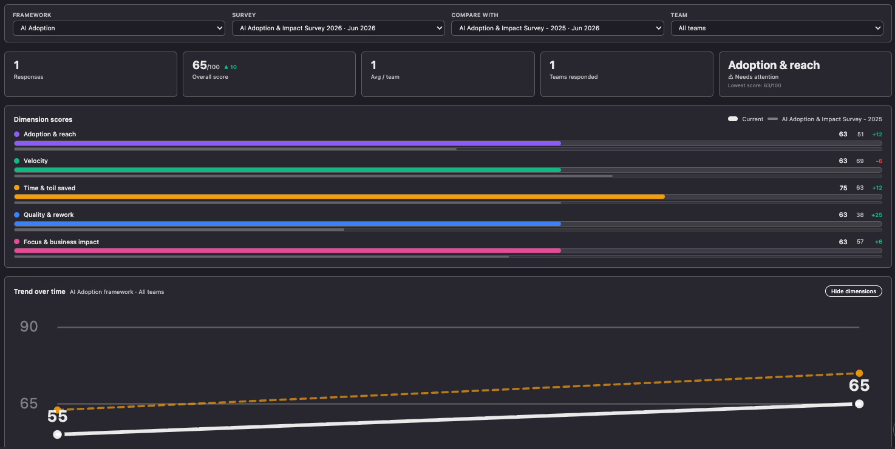

# Survey Analytics

> Part of the **Survey Intelligence** suite (Port Engineering Intelligence): [Survey Builder](../engineering-intelligence-survey-builder) (author) → [Survey Forms](../engineering-intelligence-survey-forms) (run) → **Survey Analytics** (analyze). See the [setup guide](https://docs.port.io/guides/all/create-survey-intelligence).

Read-only analytics for engineering surveys run in [Port](https://app.port.io).
Reads `survey` definitions and their `surveyResponse` entities and renders
scores, trends, participation, and benchmark comparisons - no data is written.

## Preview image



## Features

- **Filters** - scope by survey, framework, and team, and **Compare with** a specific previous survey of the same framework.
- **Summary cards** - responses, overall score, average responses per team, teams responded, and the weakest dimension.
- **Team by dimension heatmap** - each team's score per dimension, plus an overall column.
- **Dimension scores** - average per-dimension score (0-100), with the compare survey overlaid when selected.
- **Trend over time** - overall and per-dimension scores across surveys of the same framework; dimension lines are toggleable.
- **Participation** - responses versus target per team (uses `survey.targetRespondents`, falling back to Port team size).
- **Questions ranked by score** - every scored question, lowest first, with its answer distribution.
- **Multi-select responses** - per-option popularity for "select all that apply" questions (unscored), with percentage-point deltas vs the compare survey.
- **Response log** - individual submissions (anonymous-aware).
- **Benchmark tab** - compares supported frameworks (e.g. DORA) against a bundled industry reference (DORA 2025).
- Loading, empty, and error states; light/dark theme via the Port SDK.

## Prerequisites

- Port account with permission to add custom plugins and read the blueprints below.
- Node.js **≥ 20**.
- [`@port-labs/port-plugins-cli`](https://www.npmjs.com/package/@port-labs/port-plugins-cli) to upload.

## Blueprints (read-only)

| Blueprint | Used for |
|-----------|----------|
| `survey` | Definition (dimensions, questions, scale) and `targetRespondents`. |
| `surveyResponse` | One submission: `dimensionScores`, `overallScore`, raw `answers`, and owning team. |
| Team (Port native) | Team names and sizes for participation. |

## Plugin parameters

| Param | Type | Required | Notes |
|-------|------|----------|-------|
| `surveyBlueprint` | blueprint | yes | Blueprint holding survey definitions. |
| `responseBlueprint` | blueprint | yes | Blueprint holding submissions. |

## Local development

```bash
cd engineering-intelligence-survey-analytics
npm install
npm run dev     # local dev with mock data (outside Port's iframe)
npm run build   # output: dist/index.html
```

## Setup

### Build

```bash
npm install
npm run build   # output: dist/index.html (single self-contained file)
```

### Upload

```bash
port-plugins upload \
  --file dist/index.html \
  --identifier survey-analytics-port-plugin \
  --title "Survey Analytics" \
  --params "$(cat upload-params.json)" \
  --upsert
```

See [@port-labs/port-plugins-cli](https://www.npmjs.com/package/@port-labs/port-plugins-cli) for CLI install and credential setup.

### Add in Port

1. Go to a dashboard page → **Edit** → **Add widget** → **Custom widget**.
2. Select **Survey Analytics**.
3. Set **Survey blueprint** = `survey` and **Response blueprint** = `surveyResponse`.
4. Save.

## Benchmark

The DORA 2025 reference distribution ships with the plugin, so the **Benchmark** tab works out of the box for DORA surveys - no benchmark blueprint or seed step required. The tab appears only for surveys whose questions resolve to a bundled benchmark.

## Troubleshooting

| Symptom | Cause | Fix |
|---------|-------|-----|
| "Configure both blueprints…" | A required param is unset | Set both `surveyBlueprint` and `responseBlueprint`. |
| No surveys listed | No published surveys | Only `active`/`closed` surveys appear; publish one in Survey Builder. |
| Empty charts | No responses for the selected survey | Collect responses via Survey Forms first. |
| No Benchmark tab | Survey has no benchmarked questions | Expected; the tab shows only for frameworks with a bundled benchmark (e.g. DORA). |
