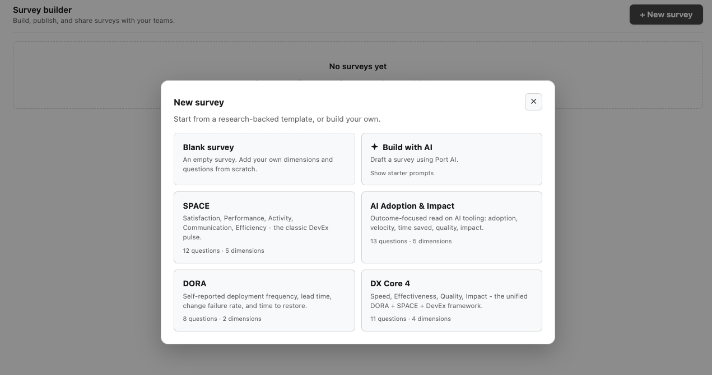

# Survey Builder

> Part of the **Survey Intelligence** suite (Port Engineering Intelligence): **Survey Builder** (author) → [Survey Forms](../engineering-intelligence-survey-forms) (run) → [Survey Analytics](../engineering-intelligence-survey-analytics) (analyze). See the [setup guide](https://docs.port.io/guides/all/create-survey-intelligence).

A visual **survey authoring** widget for Port. Compose an engineering survey -
questions, dimensions, rating scales, and metadata - and save it as a `survey`
entity. The survey's full definition is written to the entity's `definition`
property, which the **Survey Forms** runner and **Survey Analytics** dashboard
already consume. No code changes, no rebuilds: author a survey here and it is
immediately runnable.

## Preview image



## What it does

- **Lists** every `survey` entity (any status) on a dashboard, with an editor for each.
- **Creates** a new survey from a built-in template (**SPACE**, **AI Adoption**,
  **DORA**, **DX Core 4**) or a **blank** canvas.
- **Edits** everything that drives the survey:
  - **Setup** - title, framework, status, cadence, anonymity, description, and
    the default rating scale.
  - **Dimensions** - named groups used for per-dimension scoring (add / reorder /
    recolor / remove). Deleting a dimension detaches its questions automatically.
  - **Questions** - all five supported types, with required/reverse flags,
    dimension mapping, help text, and choice editing (with optional per-choice
    scores for single-choice items).
- **Live preview** - renders the working draft through the exact same form the
  runner uses, so authors see precisely what respondents get.
- **Saves** by upserting the `survey` entity (`upsert=true&merge=true`).

### Supported question types

| Type            | Scored?            | Notes                                       |
| --------------- | ------------------ | ------------------------------------------- |
| Rating scale    | yes                | Likert on the survey's default scale        |
| Single choice   | optional           | One option; choices may carry a score       |
| Multi-select    | no                 | Several options                             |
| Yes / No        | yes (1/0)          | Boolean                                     |
| Free text       | no                 | Open response                               |

## How it fits the data model

The plugin reads and writes the **`survey`** blueprint (unchanged):

| Property            | Type   | Written by the builder                              |
| ------------------- | ------ | --------------------------------------------------- |
| `framework`         | enum   | `SPACE` · `AI Adoption` · `DORA` · `DX Core 4` · `custom` |
| `status`            | enum   | `draft` · `active` · `closed`                       |
| `cadence`           | enum   | `one-off` · `monthly` · `quarterly`                 |
| `description`       | string | Markdown intro shown to respondents                 |
| `definition`        | object | **Full survey definition** (dimensions, questions, scale) |

The `definition` object is the same `SurveyDefinition` shape the runner resolves
with priority *inline definition → framework template → default* - so a survey
authored here overrides any built-in template automatically.

## Prerequisites

- Port account with permission to add custom plugins and read/write the `survey` blueprint.
- Node.js **≥ 20**.
- [`@port-labs/port-plugins-cli`](https://www.npmjs.com/package/@port-labs/port-plugins-cli) to upload.
- The `survey` blueprint must exist (see [How it fits the data model](#how-it-fits-the-data-model)); Survey Forms and Survey Analytics share it.

## Parameters

| Param | Type | Required | Description |
| --- | --- | --- | --- |
| `surveyBlueprint` | blueprint | yes | Blueprint that holds survey definitions. |
| `respondentUrl` | string | no | Dashboard URL of the Survey Forms widget, used for the **Open survey** link. Optional; defaults are derived from the embedding portal. |
| `analyticsUrl` | string | no | Dashboard URL of the Survey Analytics widget, used for the **View responses** link. Optional; defaults are derived from the embedding portal. |

## Surfaces

- **Dashboard** - place the widget on a dashboard with `surveyBlueprint` set to
  manage all surveys (list, create, edit, delete).
- **Survey entity page** - placed on a `survey` entity page, it opens that survey
  in the editor directly.

## Develop

```bash
npm install
npm run dev      # http://localhost:9000 - runs with mock surveys/teams
npm run build    # → dist/index.html (single inlined file)
```

In dev (outside Port's iframe) the widget mocks the dashboard surface with a
couple of sample surveys and teams, so the full builder is exercisable offline.

## Upload to Port

```bash
npx @port-labs/port-plugins-cli upload \
  --file dist/index.html \
  --identifier survey-builder-port-plugin \
  --title "Survey Builder" \
  --params "$(cat upload-params.json)" \
  --upsert \
  --client-id "$PORT_CLIENT_ID" \
  --client-secret "$PORT_CLIENT_SECRET" \
  --port-api-base-url https://api.port.io
```

## Adding a template

Drop a `SurveyDefinition` file in `src/surveys/` and register it in
`src/surveys/registry.ts` (`TEMPLATES`). It then appears as a starting point in
the "New survey" picker - no other changes needed.
