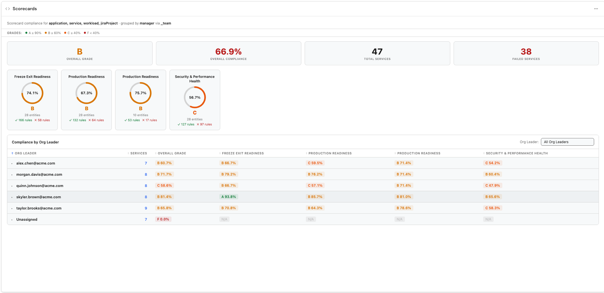

# Scorecard Dashboard

A scorecard compliance dashboard widget for [Port](https://app.port.io) dashboards. Groups services by org leader (via team relations), shows overall and per-scorecard compliance grades, and lets you drill into individual service compliance across all configured scorecards.

## Preview image



## Features

- Overall compliance grade card with passing/failing rule counts
- Per-scorecard compliance cards with aggregate grades
- Org-leader breakdown table: services per leader, per-scorecard grades
- Drilldown: click a leader row to see individual service compliance
- Sortable columns with sticky header
- Configurable grade thresholds (A/B/C/F)
- Scorecard filtering (show specific scorecards only)
- Similar-scorecard aggregation across multiple blueprints
- Light/dark theme support via Port SDK

## Prerequisites

### Blueprints & properties

The widget reads from your existing service and team blueprints plus Port's built-in scorecard system.

| Concept | Blueprint | Notes |
|---------|-----------|-------|
| Services | `blueprint1`–`blueprint5` | Any blueprint with scorecards attached |
| Teams | `teamBlueprint` (default: `_team`) | Port's built-in team blueprint |

### Relations

The widget requires catalog relations between teams and services. Configure at least one of:

| Relation param | Direction | Example identifier |
|----------------|-----------|--------------------|
| `teamServicesRelation` | Team → Services | `services` |
| `serviceTeamRelation` | Service → Team | `team` |
| `teamManagerRelation` | Team → manager user | `manager` (default) |

If `teamServicesRelation` is set, teams are queried first and services are resolved via that relation. If only `serviceTeamRelation` is set, services are queried and grouped by their team relation. Both can be set; `teamServicesRelation` takes precedence.

**These relation params exist because relation identifiers vary between Port instances.** Inspect your blueprint schemas to find the correct identifier.

### Scorecards

Scorecards must be configured on the service blueprints in Port. The widget reads scorecards via `GET /v1/scorecards` and filters to those attached to your configured service blueprints.

## Widget parameters

| Key | Type | Required | Default | Description |
|-----|------|----------|---------|-------------|
| `blueprint1` | blueprint | yes | — | Primary service blueprint |
| `blueprint2`–`blueprint5` | blueprint | no | — | Additional service blueprints |
| `teamBlueprint` | string | no | `_team` | Team blueprint identifier |
| `teamServicesRelation` | string | no | — | Team → services relation identifier |
| `teamManagerRelation` | string | no | `manager` | Team → manager relation identifier |
| `serviceTeamRelation` | string | no | — | Service → team relation identifier (reverse lookup) |
| `gradeA` | number | no | 90 | Minimum % for grade A |
| `gradeB` | number | no | 70 | Minimum % for grade B |
| `gradeC` | number | no | 50 | Minimum % for grade C |
| `aggregateSimilar` | boolean | no | false | Merge rules with the same title across similar scorecards |
| `scorecardIds` | string | no | all | Comma-separated scorecard identifiers to display |

**Note:** `teamBlueprint`, `teamServicesRelation`, `teamManagerRelation`, and `serviceTeamRelation` are string params (not blueprint-type pickers) because Port's team blueprint and relation identifiers vary between instances and cannot be resolved automatically at runtime.

## Local development

```bash
cd scorecard-dashboard
npm install
npm run dev   # http://localhost:9000
```

This is a dashboard widget (no entity context required). Configure mock data in `src/hooks/usePostMessageData.ts`.

## Setup

### Build

```bash
npm install
npm run build   # output: dist/index.html
```

### Upload

```bash
port-plugins upload \
  --file dist/index.html \
  --identifier scorecard-dashboard-port-plugin \
  --title "Scorecard Dashboard" \
  --params "$(cat upload-params.json)" \
  --upsert
```

See [@port-labs/port-plugins-cli](https://www.npmjs.com/package/@port-labs/port-plugins-cli) for CLI install and credential setup.

### Add in Port

1. Go to a dashboard page → **Edit** → **Add widget** → **Custom widget**
2. Select **Scorecard Dashboard**
3. Set `blueprint1` to your primary service blueprint
4. Set relation params to match your catalog schema (check `GET /v1/blueprints/{id}` for relation identifiers)
5. Save

## Project structure

```
scorecard-dashboard/
  src/
    components/
      ScorecardDashboard/
        ScorecardDashboard.tsx  # Main component
        ScorecardDashboard.css  # Scoped styles
        useScorecardData.ts     # Data fetching and aggregation
    types.ts
    App.tsx
    index.tsx
  upload-params.json
  webpack.config.js
  tsconfig.json
```

## Troubleshooting

| Symptom | Cause | Fix |
|---------|-------|-----|
| No org leader data | Relation params misconfigured | Check `teamManagerRelation` and `teamServicesRelation` match your catalog |
| Services not grouped | `serviceTeamRelation` empty + `teamServicesRelation` not resolving | Set at least one relation param |
| Scorecards not showing | Blueprints have no scorecards | Configure scorecards on the service blueprints in Port |
| Grade thresholds ignored | Params not saved | Redeploy with updated `upload-params.json` |
| Port API error | Blueprint identifier wrong or no access | Verify blueprint identifiers and token permissions |
