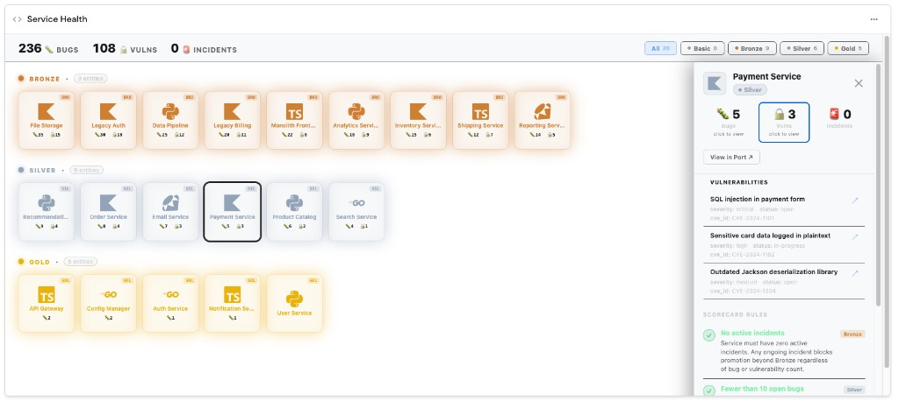

# Scorecard Grid

A colour-coded health grid widget for [Port](https://app.port.io) dashboards. Displays all entities of a blueprint as sized cubes grouped by their scorecard level, with counters, drill-down panels, and a sticky detail sidebar.

## Preview image



## Features

- Entities rendered as colour-coded cubes grouped by scorecard level (e.g. Gold / Silver / Bronze)
- Lowest-rank cubes pulse with a glow animation to draw attention
- Summary bar with configurable emoji counters (e.g. 🪲 bugs, 🐛 vulnerabilities) and level filter buttons
- Click any cube to open a sticky detail sidebar showing:
  - Scorecard rule pass/fail status
  - Stat cards per counter with one-click drill-down to related entities
  - "View in Port" button that navigates to the entity page
- Live polling at a configurable interval
- Light/dark theme support via Port SDK

## Prerequisites

### Blueprints

The widget works with any blueprint that has a scorecard attached. No special blueprint setup is required beyond what Port already provides.

## Widget parameters

| Key | Type | Required | Default | Description |
|-----|------|----------|---------|-------------|
| `blueprint` | blueprint | yes | — | Blueprint whose entities to display |
| `scorecardIdentifier` | string | yes | — | Identifier of the scorecard on that blueprint |
| `counters` | array | yes | — | Counter badges. Each item: `{"emoji":"🪲","label":"Bugs","property":"open_bug_count"}` |
| `drillDown` | array | yes | — | Drill-down sections. Each item: `{"label":"Bugs","blueprint":"jira_bug","query":{"combinator":"and","rules":[]},"include":["$title","priority"]}`. A `relatedTo` filter for the selected entity is always injected automatically. |
| `pollIntervalSeconds` | number | no | 60 | How often to re-fetch data from Port (seconds) |

## Local development

```bash
cd scorecard-grid
npm install
npm run dev   # http://localhost:9000
```

Configure mock data in `src/hooks/usePluginData.ts` — edit `DEV_PARAMS` to simulate the values you'd set in Port. Set `PORT_TOKEN` and `PORT_API_BASE_URL` environment variables (via a `.env` file) for the widget to call the real Port API in dev mode.

## Setup

### Build

```bash
npm install
npm run build   # output: dist/index.html
```

### Upload

```bash
port-plugins upload \
  --file dist/index.html \
  --identifier scorecard-grid \
  --title "Scorecard Grid" \
  --params "$(cat upload-params.json)" \
  --upsert
```

See [@port-labs/port-plugins-cli](https://www.npmjs.com/package/@port-labs/port-plugins-cli) for CLI install and credential setup.

### Add in Port

1. Go to a dashboard page → **Edit** → **Add widget** → **Custom widget**
2. Select **Scorecard Grid**
3. Set `blueprint` to the blueprint you want to visualize
4. Set `scorecardIdentifier` to the scorecard's identifier
5. Define `counters` — one object per numeric property you want shown as a badge (e.g. `[{"emoji":"🪲","label":"Bugs","property":"open_bug_count"}]`)
6. Define `drillDown` — one object per counter, pointing to a related blueprint whose entities you want to drill into
7. Optionally set `pollIntervalSeconds` (default: 60)
8. Save

## Project structure

```
scorecard-grid/
  src/
    components/
      Cube.tsx          # Individual entity cube
      DetailPanel.tsx   # Sticky sidebar with rules + stat cards
      DrillDown.tsx     # Related-entity list inside the sidebar
      EntityIcon.tsx    # simple-icons lookup with initials fallback
    hooks/
      usePluginData.ts  # SDK wrapper + DEV_MOCK params
    api.ts              # fetchAll (scorecard + entities) and fetchDrillDownItems
    App.tsx             # Layout: nav, summary bar, cube grid, detail aside
    App.css             # All styles — uses Port theme CSS variables with fallbacks
    constants.ts        # Port colour → hex map and hexToRgba helper
    types.ts            # PluginConfig, Entity, ScorecardLevel, etc.
  upload-params.json
  webpack.config.js
  tsconfig.json
```

## Troubleshooting

| Symptom | Cause | Fix |
|---------|-------|-----|
| "Widget configuration is incomplete" | Required params not set | Ensure `blueprint`, `scorecardIdentifier`, `counters`, and `drillDown` are all configured |
| All cubes show the same level | Scorecard has no rules or all entities pass/fail identically | Verify the scorecard has rules and entities have varying compliance |
| Drill-down shows "No items found" | No related entities match the query | Check `drillDown[n].blueprint` and that the selected entity has relations to that blueprint |
| Port API error in error banner | Auth failure or wrong identifiers | Verify `blueprintIdentifier` and `scorecardIdentifier`; confirm the token has read access |
| Counters always show 0 | Wrong property key in `counters[n].property` | Check the exact property identifier on your blueprint |
