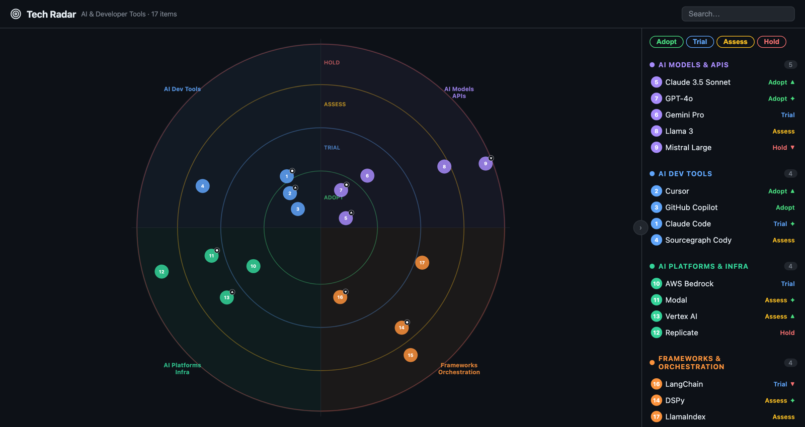

# Tech Radar

A custom plugin for [Port](https://app.port.io) that renders a Zalando/ThoughtWorks-style tech radar from your software catalog. Entities are plotted as blips on a four-quadrant, four-ring radar; hovering shows a tooltip and clicking opens a detail panel. Works on any dashboard or entity page.

## Preview image



## Features

- Four-quadrant, four-ring SVG radar with deterministic blip placement per entity
- Collapsible legend grouped by quadrant, with per-ring and per-quadrant highlighting
- Click a blip for a detail panel (ring, quadrant, description, "Learn more" link)
- Real-time search across name, quadrant, ring, and description
- Configurable source blueprint (defaults to `software`)
- Light/dark theme support via the Port SDK

## Prerequisites

### Access

A Port user account with at least **viewer** access to the blueprint you render.

### Blueprint & properties

No new blueprint is required — point the widget at any blueprint whose entities carry the properties below. The widget fetches entities at runtime via `POST /v1/entities/search`.

| Property      | Type     | Required | Notes                                              |
| ------------- | -------- | -------- | -------------------------------------------------- |
| `ring`        | string   | yes      | One of `Adopt`, `Trial`, `Assess`, `Hold`          |
| `quadrant`    | string   | yes      | One of the four quadrants (see below)              |
| `description` | string   | no       | Shown in the tooltip and detail panel              |
| `url`         | string   | no       | "Learn more" link in the detail panel              |
| `moved`       | number   | no       | `2` = new, `1` = moved in, `0` = same, `-1` = out  |

The quadrants, rings, colors, and label ordering live in [`src/types.ts`](src/types.ts) — change them there if you want different categories. Default quadrants: `AI Models & APIs`, `AI Dev Tools`, `AI Platforms & Infra`, `Frameworks & Orchestration`. Entities whose `ring` or `quadrant` don't match the allowed values are silently dropped.

## Plugin parameters

| Key | Type | Required | Default | Description |
|-----|------|----------|---------|-------------|
| `blueprint` | blueprint | no | `software` | The blueprint whose entities are plotted on the radar |

## Local development

```bash
cd tech-radar
npm install
npm run dev   # http://localhost:9000
```

Outside of Port, `usePortPluginData()` does not receive a token, so the radar shows "Connecting to Port…". Test interactively inside Port for full functionality.

## Setup

### Build

```bash
npm install
npm run build   # output: dist/index.html (single self-contained file)
```

### Upload

```bash
port-plugins upload \
  --file dist/index.html \
  --identifier tech-radar-port-plugin \
  --title "Tech Radar" \
  --params "$(cat upload-params.json)" \
  --description "Visualize software entities by ring and quadrant" \
  --upsert
```

See [@port-labs/port-plugins-cli](https://www.npmjs.com/package/@port-labs/port-plugins-cli) for CLI install and credential setup. `--upsert` updates the existing plugin in place.

### Add in Port

1. Open the **Plugins Manager** in Port and confirm `tech-radar` is listed.
2. On any dashboard or entity page, **Add widget → Custom widget → Tech Radar**.
3. Optionally set the **Blueprint** parameter to the blueprint you want to render (defaults to `software`).
4. Save. The widget queries `/v1/entities/search` for that blueprint and renders the radar.

## Project structure

```
tech-radar/
  src/
    index.tsx, index.html    # Entry point
    App.tsx, App.css         # Top-level UI + theme integration
    api.ts                   # Port entities-search API call
    types.ts                 # Rings, quadrants, geometry constants
    components/
      Radar.tsx              # SVG radar (wedges, rings, blips)
      Legend.tsx             # Sidebar with grouped blip list
      Tooltip.tsx            # Hover tooltip
    utils/radar.ts           # Blip positioning (deterministic per id)
  upload-params.json
  webpack.config.js
  tsconfig.json
```

Built with React 19, TypeScript, and webpack. The production build inlines all JS/CSS into a single `dist/index.html` so the plugin meets Port's single-file requirement.

## Troubleshooting

| Symptom | Cause | Fix |
|---------|-------|-----|
| Radar stuck on "Connecting to Port…" | Running outside Port (no token) | Expected in local dev; works inside the Port iframe |
| "No entities found" | Blueprint empty or wrong identifier | Verify the `blueprint` param and that its entities exist |
| Entity missing from the radar | `ring` or `quadrant` value not in the allowed set | Use exact values from `src/types.ts` (`Adopt`/`Trial`/`Assess`/`Hold`, etc.) |
| Port API error surfaced | Network or auth issue | Error message includes the API response status for diagnosis |
